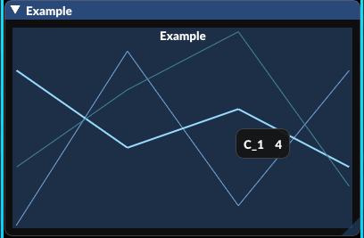

# multiplotlines.lua

[](https://github.com/Emik03/multiplotlines.lua/blob/main/LICENSE)

---

Lua port of [esquellington's imgui_multiplotlines](https://github.com/esquellington/imgui_multiplotlines): `MultiPlotLines()` is a nearly drop-in alternative to vanilla `imgui.PlotLines()` in [Dear ImGui](https://github.com/ocornut/imgui) that allows drawing multiple channels simultaneously and adds some nice optional features on top.

This implementation assumes ImGui version 1.67.0, the same version the video game [Quaver](https://github.com/Quaver/Quaver) currently uses.

---

- [Usage](#usage)
- [Contribute](#contribute)
- [License](#license)

---

## Usage

To use this library, either download [multiplotlines.lua](multiplotlines.lua) locally or use [Luaver](https://github.com/ESV-Sweetplum/Luaver) if you are writing a Quaver plugin, as this library is included.

Use the function `MultiPlotLines`, and be sure to store and reuse `params` to maintain state:

```lua
local state = {}

function draw()
    imgui.Begin("Example")

    state = MultiPlotLines(
        "Example", -- Header text is placed top-center of the plot.
        {0, 9, 1, 8, 4, 6, 3, 7, 10, 2, 5, 8}, -- Either pass a table of numbers, a table of table of numbers, or a function.
        nil, -- The context value used for any function callback, such as the above, or functions in 'params'.
        4, -- The number of values per channel.
        3, -- The number of channels.
        state -- The layout parameters, alongside state information.
    )

    imgui.End()
end
```

The result should look like this:



You may also check out [plugin.lua](demo/plugin.lua) for examples, which showcases most parameters. 

## Contribute

Issues and pull requests are welcome to help this repository be the best it can be.

## License

This repository — which includes every source file separately — fall under the [MPL-2 license](https://www.mozilla.org/en-US/MPL/2.0/).

You may copy individual or multiple source files, granted that you keep the copyright license, and disclose the source back to this repository.
